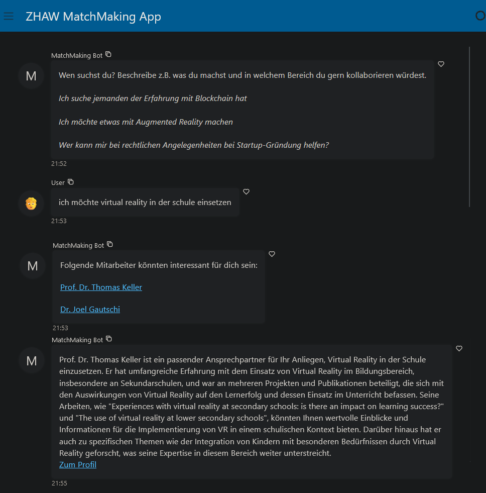

<div align="center">

# ZHAW MatchMaking

</div>

A simple chatbot which takes a user query as input and suggests people to 
collaborate with based on the context of their profile data from the [ZHAW 
homepage](https://www.zhaw.ch).<br>
The backend utilises GPT-4 Turbo with LangChain as a wrapper and Pinecone 
as a 
hosted 
vector 
database.

<div align="center">
  
</div>

## Contents

- [Hosted on Replit](#hosted-on-replit)
- [Local Setup](#local-setup)
  - [Prerequisites](#prerequisites)
  - [Panel App](#panel-app)
  - [REST API](#server--rest-api)
    - [Request Templates](#request-templates)
- [TBD](#tbd)

## Hosted on Replit

- [Panel App](https://zhaw-matchmaking-app--przvlprd.repl.co/app)
- REST API: [Docs](https://zhaw-matchmaking-api--przvlprd.repl.co/docs)
  - send your request to either (see [below](#request-templates) for 
    instructions): </br>
  `https://zhaw-matchmaking-api--przvlprd.repl.co/query/` </br>
  `https://zhaw-matchmaking-api--przvlprd.repl.co/query-stream/` </br>

*(it may take up to 30s to get the replit repos running)*

<div align="center">
<a href="demo.png" target="_blank">
  
</a>
</div>
<div align="center">
Demo of the Panel app
</div>


## Local Setup
Follow the notebook `Guide from Scratch.ipynb` to reproduce the steps 
needed to run the bot locally or deploy it.

### Prerequisites
- create & activate virtual environment
```shell
# PowerShell
python -m venv env
.\env\Scripts\activate

# Linux / WSL
virtualenv --python python3.11 venv
source venv/bin/activate
```

- install requirements
```shell
pip install -r requirements.txt
```

- replace environment variables in `.env`:
  - `OPENAI_API_KEY` 
  - `PINECONE_API_KEY`
  - `PINECONE_ENVIRONMENT`
  - `PINECONE_INDEX`

### Panel App

```shell
panel serve app.py --autoreload --show
```

### Server / REST API

- run the uvicorn server
```shell
python server.py
```

#### Request Templates
- send a POST request to `http://localhost:8000/query/` with
  - `user_input` - the search query - **necessary**
  - `search` - the search type *(optional)*
    - `"sim"` similarity search *(default)*
    - `"mmr"` maximum marginal relevance search
  - `k` - number of retrieved documents *(optional)*
    - `4` *(default)*, int 1 - 50
- returns **JSON**
```shell
curl -X POST -H "Content-Type: application/json" -d '{
    "user_input": "your search query",
    "search": "sim",
    "k": 4
}' http://localhost:8000/query/
```

##### Streaming

- as above, but send a POST request to `http://localhost:8000/query-stream/`
- returns **streamed text**
```shell
curl -X POST -H "Content-Type: application/json" -d '{
    "user_input": "your search query",
    "search": "sim",
    "k": 4
}' http://localhost:8000/query-stream/
```

## TBD
This project serves as a first *proof-of-concept*. Things which could be done 
include:
- [ ] thorough debugging and testing
  - error handling & unit tests
  - add logging for user queries and generated responses
    - currently only the deployed version uses `LangSmith` to log llm calls
- [ ] refactor to OOP
- [ ] add interactive chatbot capabilities (and memory)
  - only use retrieval when necessary
  - be able to converse with the user
- [ ] use keyword extraction from the user query (instead of  the whole 
  query for retrieval)
- [ ] get more varied results
  - e.g. random selection from retrieved sources
- [ ] get rid of possibly bloated *LangChain* implementation
  - use custom logic (see point below)
- [ ] take advantage of GPT-4 Turbo's increased context window size (up to 
  128k tokens) for analyzing the relevant profile documents
- [ ] automate scraping the website & updating the vectordb for removed, 
  newly added, and changed profiles
  - catch invalid profiles instead of letting LLM generate reply based on 
    missing context
- [ ] add multilingual support
  - detect the user input language and use it for response generation 
    (currently forced to reply in German)
- [ ] add working frontend (e.g. with React) other than the current Panel 
  template
- possibly more...

**Feel free to reach out in case something is broken!**